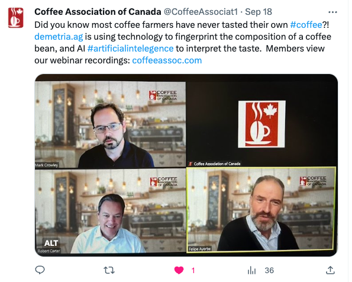

TODO: DRAFT

## Coffee panel
Last month I had a chance to combined two things I like a lot: Coffee and Artificial Intelligence!

I recently did a panel discussion at the invitation of the Coffee Association of Canada (CAC), and the topic was on the use of Artificial Intelligence in various parts of the industry. 
I learned a lot in fact about what was being done with coffee and AI, at the most fundamental chemical level, very exciting. I also gave some assessment of AI in that industry, the economy, and the world in general. 

**[Update:]** you can listen see a summary of the discussion in [industry news piece](https://www.foodserviceandhospitality.com/cac-highlights-the-impact-of-ai-on-coffee-during-its-monthly-webinar-series/?cn-reloaded=1) and also includes a link to the video.

#### Todo
- [ ] social
- [ ] website/news

## Comings and Goings
We had a lot of news here! Three lab members at Waterloo completed their graduate degrees this summer:
- Xiaoliang Zhou
- Josh - successful MASc Seminar, waiting for thesis comments
- Zehra - Successfully defended her PhD thesis on DATE!
    - title, abstract, citation 

Other Team changes and achievements:
- Vlad - completed his project on headed back to Lithuainia
- Shayan - Successful PhD defence on DATE on topic, presentation of ICML paper was well received
- Kyle Sprague - successfully completed his work on ChemGymRL and starts grad school at UAlberta
- ChrisBeeler - still doing position at vector?

## Publications
- sriram - any news? did we have news for IJCAI presentation?
- shayan?

## Conference
- Mark - went to ICML in Hawaii for two papers (cite1, cite2)
- ICML!
    - [Causality](/causality/)
    - [MARL](/marl/)
    - [ChemGymRl](/ai-for-science/) and [AI/ML for Science](/ai-for-science/) more generally

